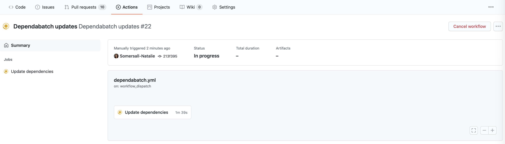
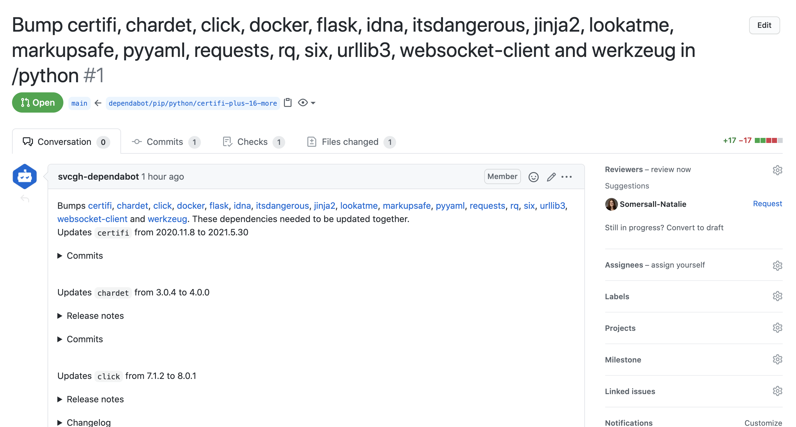

# Dependabatch - batched Dependabot updates using GitHub Actions

This repo contains a GitHub Action for Dependabot, plus some logic to batch dependencies of an arbitrary size into a single PR.

This builds on [dependabot-core](https://github.com/dependabot/dependabot-core) and [dependabot-script](https://github.com/dependabot/dependabot-script) to provide batched updates.  I recommend using the `on.schedule` setting to run it every week or so.  Documentation on how to do that [here](https://docs.github.com/en/actions/reference/workflow-syntax-for-github-actions#onschedule).

:warning: It does not respect or parse `~/.github/dependabot.yml`, but uses more or less the same syntax to feed information into Dependabot.

:information_source:  I added support for GitHub Enterprise Server, since that's where a lot of our development takes place.  The GHES fields are optional in `action.yml`, so it will run against GitHub.com if you omit them.  That's also why the token for GitHub.com is stored as a secret and not as `${{ github.token }}`, as that will vary based on where you're running this Action.

:information_source: The GHES access token needs the `repo` scope.  It also needs the `workflow` scope in order to update GitHub Actions.

Example workflow using GitHub Enterprise Server:

```YAML
name: Dependabatch updates

on:
  workflow_dispatch:
  schedule:
    # * is special in YAML.  This runs at 4:45 am on Sundays.
    - cron: '45 4 * * 0'

jobs:
  update-deps:
    name: Update dependencies
    runs-on: [ ubuntu-latest ]

    steps:
      - name: Update python deps
        uses: boozallen/dependency-update-action@v1
        with:
          dotcom_token: ${{ secrets.DOTCOM_TOKEN }}
          ghe_token: ${{ secrets.GHE_TOKEN }}
          ghe_hostname: ${{ secrets.GHE_HOSTNAME }}
          repo_name: ${{ github.repository }}
          directory: "/python"
          package_manager: "pip"
          batch_size: "20"
      
      - name: Update JavaScript deps
        uses: boozallen/dependency-update-action@v1
        with:
          dotcom_token: ${{ secrets.DOTCOM_TOKEN }}
          ghe_token: ${{ secrets.GHE_TOKEN }}
          ghe_hostname: ${{ secrets.GHE_HOSTNAME }}
          repo_name: ${{ github.repository }}
          directory: "/javascript"
          package_manager: "npm_and_yarn"
          batch_size: "5"
      
      - name: Update GitHub Actions
        uses: boozallen/dependency-update-action@v1
        with:
          dotcom_token: ${{ secrets.DOTCOM_TOKEN }}
          ghe_token: ${{ secrets.GHE_TOKEN }}
          ghe_hostname: ${{ secrets.GHE_HOSTNAME }}
          repo_name: ${{ github.repository }}
          directory: "/"
          package_manager: "github_actions"
          batch_size: "1"
```

Here are some images of it hard at work so we don't have to be!




